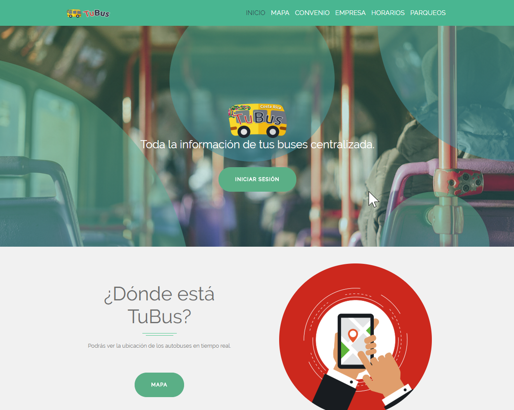
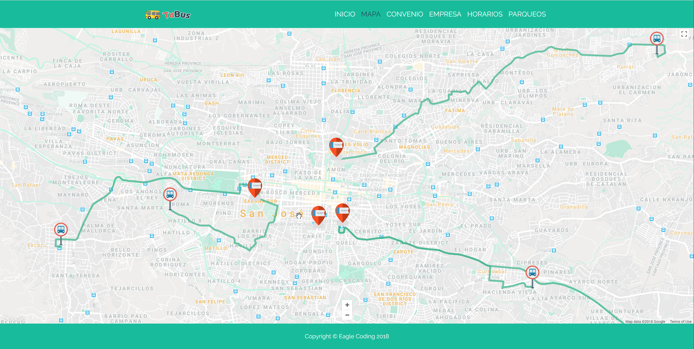
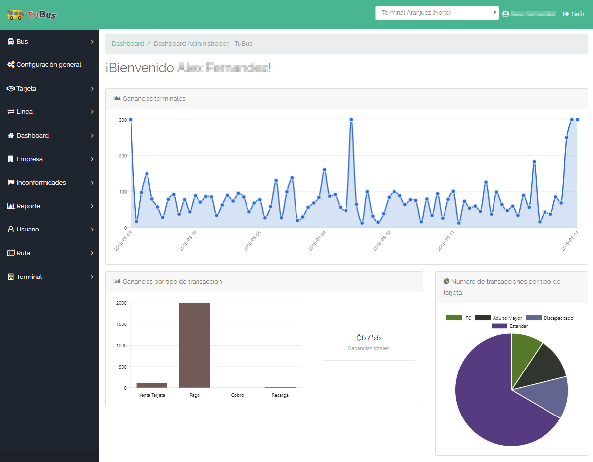

# TuBus
This project was developed by 4 students during a two months period using C#, ASP.net Web API 2, MVC (Web App client), SparkPost, Stripe, MS SQL, MS SQL Reporting Services, Google Maps API and Swagger.

## DESCRIPCIÓN DEL PROBLEMA
La Dirección Nacional de Transporte y Aeronáutica de Costa Rica es una empresa de capital costarricense confirmada por el Gobierno de Costa Rica, con un 20 %, la Cooperativa de Autobuseros de Costa Rica en un 70 % y el INCOFER en un 10 %. Esta empresa surge con la necesidad de ordenar el transporte público de costa rica y a recibido la concesión exclusiva por 25 años para el desarrollo y administración de las terminales. Se iniciaría con una terminal, pero se espera el desarrollo de más terminales en San José y otras provincias dentro de los 10 años siguientes.
La dirección cuenta con cinco años de existencia y en junio del 2018 espera inaugurar la primera de cuatro terminales que van servir para que las diferentes líneas de bus que hoy ingresan a la capital lleguen a dichas terminales, con el fin de descongestionar el casco central de San José y ayudar a lograr el objetivo de ser carbono neutral en el 2021.
Las terminales estarían ubicadas inicialmente en Barrio Aranjuez, al lado de la antigua estación de trenes al pacífico, Municipalidad de San José y al costado de la Plaza González Víquez.
Debido a que la dirección pondrá en funcionamiento la primera de las terminales en junio del presente año requiere de un aplicativo que le permita administrar esta terminal y otras así como permitir el funcionamiento diario de las misma de una manera tecnológica que se adapte a tendencias y estándares actuales. Dado a que esto es una nueva implementación, no existen aplicaciones o procesos actuales para la operación. SIn embargo se tiene como base la manera en la que las mismas son operadas de manera individual y manual. El proyecto pretende crear un estándar para la administracion y operacion de las terminales de tal forma que se pueda escalar y tener un mayor grupo de usuario finales beneficiados con el mismo.

## Eagle coding
Coordinación: Ana Juárez
Soporte: Mary Paz Araya
Desarrollo: Alex Fernández 
Calidad: Jose Solano Montoya

## License 
Creative Commons Attribution 4.0

